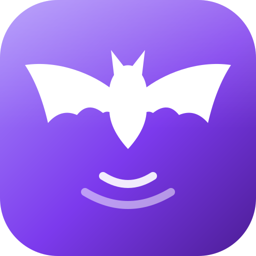
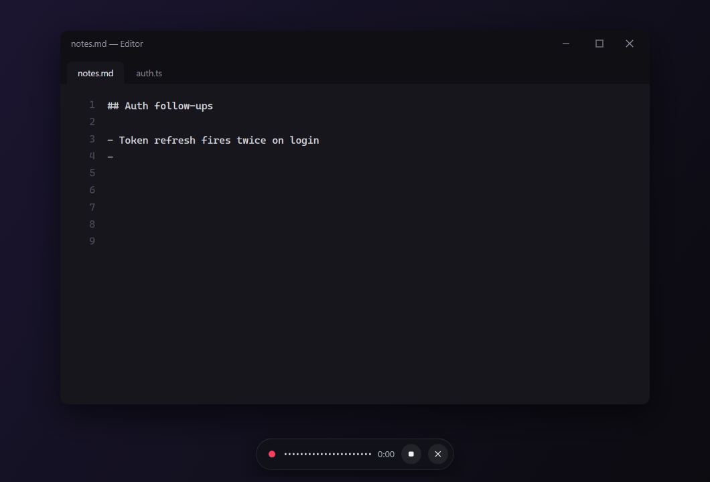
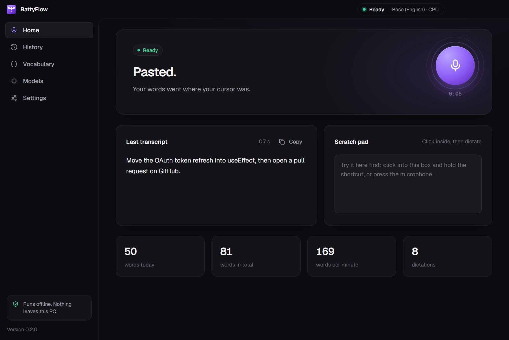
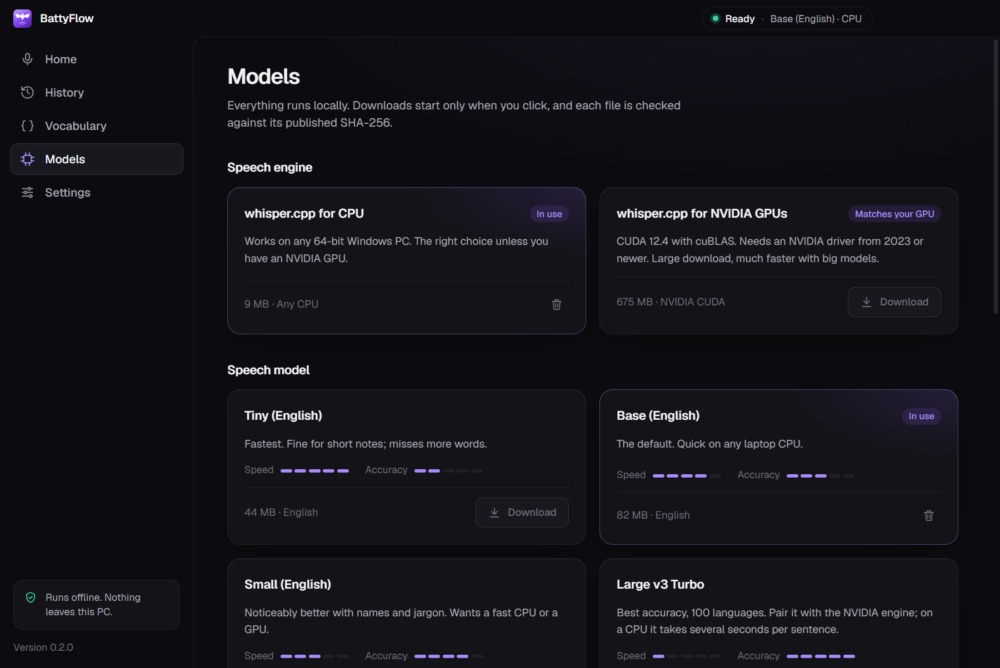
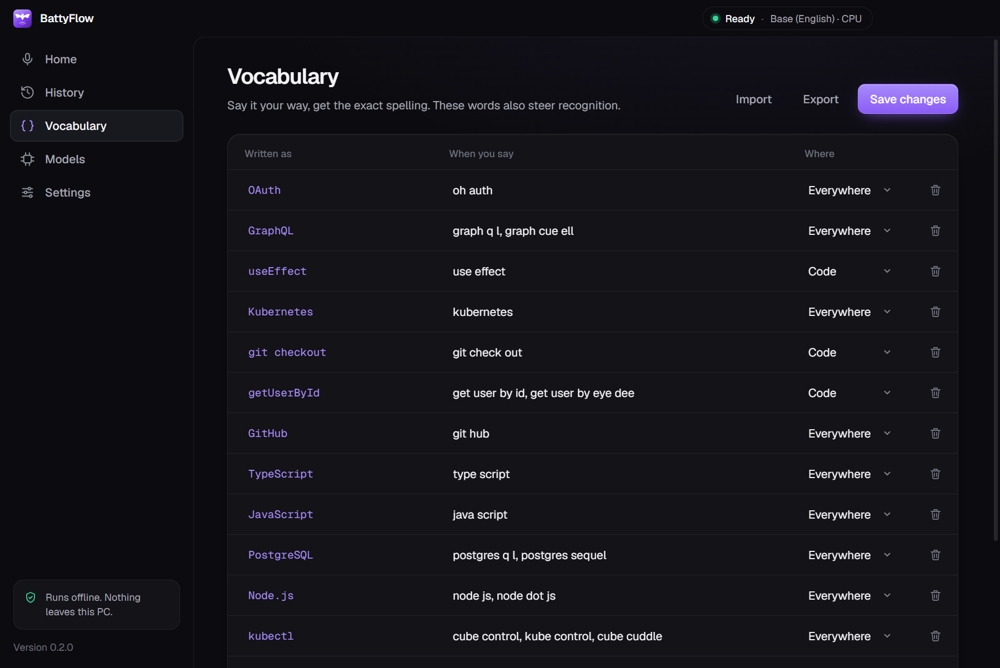
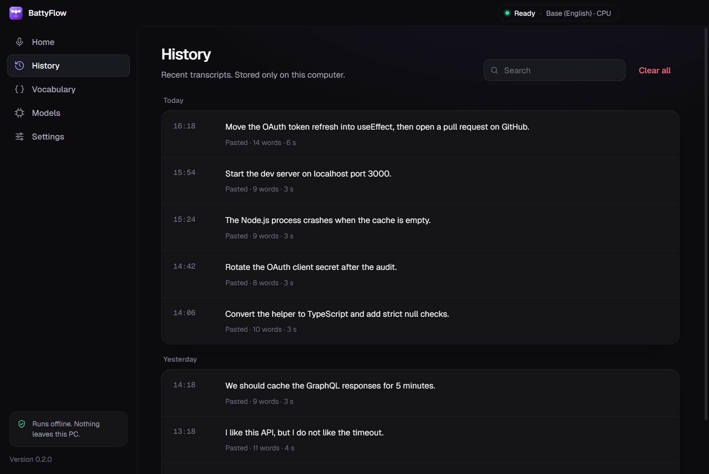

<p align="center">
  
</p>

<h1 align="center">BattyFlow</h1>

<p align="center">
  <strong>Hold a key, say it, let go. The words appear wherever your cursor is.</strong><br>
  Offline dictation for Windows that runs Whisper on your own machine and gets developer words right.
</p>

<p align="center">
  <a href="https://github.com/ArjunShuklaCSE/BattyFlow/releases/latest"></a>
  <a href="https://github.com/ArjunShuklaCSE/BattyFlow/actions/workflows/ci.yml"></a>
  
  
  <a href="LICENSE"></a>
</p>

<p align="center">
  
</p>

## Why BattyFlow

Most dictation tools send your voice to a server, and most local ones turn `useEffect` into "use effect" and `kubectl` into "cube control". BattyFlow does neither.

- Hold <kbd>Ctrl</kbd> <kbd>Win</kbd> in any app, talk, and let go. The text is typed where your cursor was: editor, terminal, browser or chat. For longer dictation, tap <kbd>Ctrl</kbd> <kbd>Alt</kbd> <kbd>D</kbd> to start and again to stop.
- A vocabulary maps what you say to what you mean ("get user by id" becomes `getUserById`) and steers Whisper toward those spellings. In our tests that took exact technical terms from 8 to 14 out of 18 with the same model.
- A typical sentence takes about half a second from letting go to text, with the default model on a laptop CPU. With an NVIDIA GPU you can run Large v3 Turbo, which covers 100 languages, at about a second.
- Output adapts to the app. Terminal commands come out as one line with no full stop (`git status`, not "Git status."), editors get code spelling, and chat apps get relaxed punctuation.
- After pasting, BattyFlow puts back whatever you had copied, and dictated text stays out of Windows clipboard history.
- Nothing leaves your PC: no account, no telemetry, no cloud. The only network request is a model download you click, checked against a pinned SHA-256.

## Get started

1. Download `BattyFlow-Setup-0.2.0.exe` from the [latest release](https://github.com/ArjunShuklaCSE/BattyFlow/releases/latest). There's also a portable `.exe` if you'd rather not install.
2. Open it and click **Download and set up**. That's 90 MB for the standard setup, or 1.25 GB for the NVIDIA GPU setup if BattyFlow finds a supported card.
3. Hold <kbd>Ctrl</kbd> <kbd>Win</kbd> in any app and talk.

> [!NOTE]
> The builds aren't code-signed yet, so Windows SmartScreen may say "Windows protected your PC". Click **More info → Run anyway**. You can check a download against the SHA-256 listed on the release page, or [build it yourself](#build-from-source).

## Screenshots

<table>
  <tr>
    <td></td>
    <td></td>
  </tr>
  <tr>
    <td></td>
    <td></td>
  </tr>
</table>

## How it works


BattyFlow remembers which window you started in. When the text is ready, it pastes only if that window is still in front, and never into password fields or apps running as administrator. If anything changed, it copies the text instead and tells you to press <kbd>Ctrl</kbd> <kbd>V</kbd>. Details are in [architecture](docs/architecture.md).

## Accuracy and speed

Measured on an Intel i7-12700H laptop with an RTX 3060, on 28 synthetic test sentences including 10 developer ones:

| Setup                                   | Word error rate | Technical terms exact | Time after you stop |
| --------------------------------------- | --------------: | --------------------: | ------------------: |
| Base (English) on the CPU, **default**  |            7.3% |               14 / 18 |              0.42 s |
| Base (English), vocabulary steering off |           11.4% |                8 / 18 |              0.39 s |
| Tiny (English) on the CPU               |           10.4% |               15 / 18 |              0.27 s |
| Large v3 Turbo on the GPU               |            5.2% |               17 / 18 |               1.1 s |

Synthetic voices are cleaner than real ones, so expect more errors with real speech. Methodology, every configuration and how to reproduce it: [benchmarks](docs/benchmarks.md).

## Models

Pick and switch models on the Models page. Everything downloads from the official whisper.cpp releases and Hugging Face, and nothing is used until its hash checks out.

| Model               |   Size | Languages | Good for                                    |
| ------------------- | -----: | --------- | ------------------------------------------- |
| Tiny (English)      |  44 MB | English   | Older machines, quick notes                 |
| **Base (English)**  |  82 MB | English   | Most people. Fast on any recent CPU         |
| Small (English)     | 264 MB | English   | Fast CPUs and GPUs                          |
| Large v3 Turbo      | 574 MB | 100       | NVIDIA GPUs, best accuracy, other languages |
| Base (multilingual) |  82 MB | 99        | Other languages on the CPU                  |

An optional local language model (Qwen2.5 via llama.cpp) can polish grammar and powers three extra modes. On an offline machine you can import any whisper.cpp model with a small manifest. See [models](docs/models.md).

## Vocabulary

Teach BattyFlow your words on the Vocabulary page:

| Written as    | When you say                  | Where      |
| ------------- | ----------------------------- | ---------- |
| `getUserById` | get user by id                | Code       |
| `kubectl`     | cube control, kube control    | Everywhere |
| `PostgreSQL`  | postgres q l, postgres sequel | Everywhere |

Spoken forms become exact spellings, longer matches win, and when two entries share a spoken form BattyFlow leaves your words alone rather than guess. "Where" limits a word to editors, terminals, chat or email apps, which BattyFlow detects from the window you're dictating into. Export and import as JSON to share a team vocabulary.

## Modes

| Mode           | Shortcut                                                                            | What it does                                                                  |
| -------------- | ----------------------------------------------------------------------------------- | ----------------------------------------------------------------------------- |
| Dictation      | Hold <kbd>Ctrl</kbd> <kbd>Win</kbd>, or <kbd>Ctrl</kbd> <kbd>Alt</kbd> <kbd>D</kbd> | Types what you say.                                                           |
| Command draft  | <kbd>Ctrl</kbd> <kbd>Alt</kbd> <kbd>J</kbd>                                         | Turns a rambling spoken request into a clear prompt for a coding agent.       |
| Edit selection | <kbd>Ctrl</kbd> <kbd>Alt</kbd> <kbd>E</kbd>                                         | Select text, say how to change it ("make this more formal"), get it replaced. |
| Translate      | Settings                                                                            | Speak in one language, paste in another.                                      |

Command, Edit and Translate use the optional local language model. Every shortcut can be changed in Settings, and push-to-talk can be Ctrl+Win, Right Ctrl, Right Alt or Caps Lock.

## Privacy

- Audio is held in memory and in a temporary file only while Whisper reads it, then deleted.
- No accounts, analytics, crash reports, update checks or cloud fallback.
- The app makes no network requests at all unless you click Download, and then only to GitHub and Hugging Face.
- History stays on your PC, and you can turn it off or clear it.

[docs/privacy.md](docs/privacy.md) lists every file BattyFlow writes and shows how to firewall it to check for yourself.

## Build from source

You need Windows 10 or 11 (x64) and Node.js 22 or newer. The native helper is compiled with the C# compiler that comes with Windows, so there's nothing else to install.

```powershell
git clone https://github.com/ArjunShuklaCSE/BattyFlow.git
cd BattyFlow
npm ci
npm start             # build and run
npm run check         # typecheck, unit tests, build
npm run package       # installer and portable .exe in release/
```

Integration checks drive the real app: `npm run smoke` (setup download, recording and transcription with a synthetic voice, IPC boundaries) and `node scripts/paste-smoke.mjs` (pasting into another window, clipboard restore, password fields). See [CONTRIBUTING.md](CONTRIBUTING.md).

## Limitations

- Paste and push-to-talk are Windows only for now. On macOS and Linux the app records, transcribes and copies.
- English is the best-tested language. Large v3 Turbo handles 100 languages, but the benchmark only covers English.
- The builds are unsigned, so SmartScreen warns the first time you run one.
- Each dictation starts whisper.cpp fresh and loads the model, which costs about 100 ms with the default model.

## Credits

BattyFlow is built on [whisper.cpp](https://github.com/ggml-org/whisper.cpp) and [llama.cpp](https://github.com/ggml-org/llama.cpp) by Georgi Gerganov and contributors, OpenAI's [Whisper](https://github.com/openai/whisper) models, Alibaba's [Qwen2.5](https://huggingface.co/Qwen), [Electron](https://www.electronjs.org/), and the [Geist](https://vercel.com/font) typeface by Vercel (SIL Open Font License).

## License

[MIT](LICENSE)
