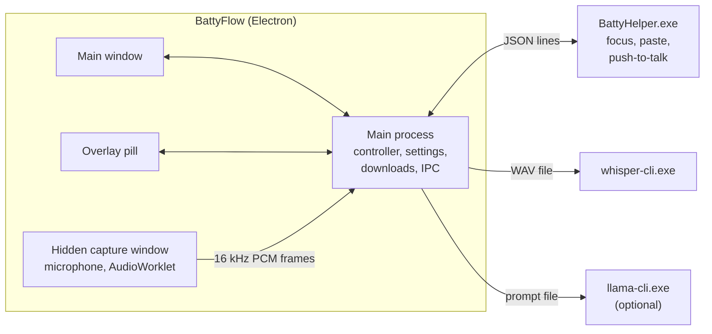

# Architecture

BattyFlow is an Electron app with a small native helper. Transcription and the optional language model run as separate local processes from whisper.cpp and llama.cpp.



## A dictation, step by step

1. **Key down.** The helper's keyboard hook sees the push-to-talk combination and tells the main process. (Tap shortcuts use Electron's `globalShortcut` instead.)
2. **Target.** The main process asks the helper which window and field are focused: window handle, process id and start time, UI Automation field id, whether it's a password field, a terminal, or an elevated app. This takes about 10 ms.
3. **Record.** The hidden capture window opens the microphone. An AudioWorklet mixes to mono and resamples to 16 kHz with a windowed-sinc filter, and sends 20 ms frames over IPC. The main process checks every frame (sequence number, length, finite values) and keeps them in a buffer sized to the recording limit.
4. **Key up.** Capture stops. A quick energy check skips silent recordings so Whisper never hallucinates on nothing.
5. **Transcribe.** The audio is written to a temporary WAV in a folder only your account can read, and `whisper-cli` runs with greedy decoding, an encoder window sized to the clip, and your vocabulary as its initial prompt.
6. **Shape.** Filler sounds are removed, spoken aliases become exact spellings ("use effect" → `useEffect`), and the text is formatted for the app: one line without a full stop for terminals, code spelling for editors, relaxed punctuation for chat.
7. **Polish (optional).** llama.cpp rewrites the text; the result is rejected if it changes negations, numbers, protected identifiers or length too much.
8. **Deliver.** The helper pastes into the original window if it's still in front, then restores your clipboard. Otherwise the text is copied and the overlay says why.

## Source map

| Path                              | What's there                                                     |
| --------------------------------- | ---------------------------------------------------------------- |
| `src/main/app.ts`                 | Startup, windows, tray, IPC handlers, protocol and network rules |
| `src/main/controller.ts`          | One recording at a time: start, frames, stop, pipeline, delivery |
| `src/main/pipeline.ts`            | Transcript shaping and the optional model pass                   |
| `src/main/text.ts`                | Filler removal, writing profiles, per-app formatting             |
| `src/main/vocabulary/resolver.ts` | Alias resolution, protected spans, the Whisper prompt            |
| `src/main/asr/whisper.ts`         | whisper-cli wrapper: verification, flags, output cleanup         |
| `src/main/llm/`                   | llama-cli wrapper, prompts, output validation                    |
| `src/main/downloads.ts`           | Pinned downloads with resume, verification and unpacking         |
| `src/main/settings/store.ts`      | Settings schema, migration, asset verification, atomic writes    |
| `src/main/history.ts`             | Local transcript history and stats                               |
| `src/main/platform/`              | Platform interface; the Windows version talks to the helper      |
| `src/main/privacy/`               | Child process sandboxing, Node network lock                      |
| `src/shared/`                     | Types, the model catalog, user-facing messages, audio utilities  |
| `src/renderer/`                   | Main window, overlay pill, capture page and AudioWorklet         |
| `native/windows/BattyHelper.cs`   | The native helper                                                |
| `tests/`                          | Unit tests (`npm test`)                                          |
| `scripts/`                        | Build, smoke tests, screenshots, fixtures, privacy tools         |
| `benchmark/`                      | Accuracy and latency benchmark                                   |

## Boundaries

- **Renderers are sandboxed**: context isolation, no Node, a strict content security policy, no navigation, no new windows, no webviews. They only load files served from the app's own `batty://app/` protocol.
- **IPC is role-checked**: each channel names the window allowed to call it (main window, overlay, or capture window), and the main process checks the sender's frame and URL on every call. The capture window can send audio but can't change settings; the overlay can start and stop but can't read history.
- **Assets are verified**: engines and models are checked against their SHA-256 (once per app run, then by size and modification time), engines also against their command-line options. The renderer can never choose an executable path.
- **Child processes** get an absolute path, an argument array, no shell, a minimal environment, a timeout and an output limit.

## The helper protocol

`BattyHelper.exe` is a single C# file compiled at build time with the C# compiler that ships with Windows (.NET Framework 4.x), so there's no SDK to install. It reads one JSON object per line on stdin and writes one per line on stdout:

```text
→ {"id":1,"op":"target"}
← {"id":1,"ok":true,"target":{"identity":"…","field":"…","secure":false,"terminal":false,"elevated":false,"app":"code","pid":4120}}
→ {"id":2,"op":"paste","text":"Hello there. ","identity":"…","terminal":false,"restore":true,"restoreDelayMs":700}
← {"id":2,"ok":true,"result":"pasted"}
→ {"id":3,"op":"ptt","groups":[[162,163],[91,92]],"swallow":false}
← {"event":"ptt","state":"down"}   … {"event":"ptt","state":"up"}
```

Operations: `target`, `selection` (target plus the selected text, never for password fields), `paste`, `ptt`, `ping`. Paste results other than `pasted` (`focus-changed`, `elevated`, `secure`, `keys-held`, `clipboard-busy`) make the app copy instead.

The helper runs three threads: one for the keyboard hook (it does nothing slow, so Windows never drops the hook), one STA thread that owns the clipboard, and the command loop. UI Automation calls run with a deadline so a frozen app can't stall it, and the main process replaces the helper if a request times out.

## Design decisions

- **A process per dictation, not a server.** whisper.cpp ships a server, but a local HTTP port is reachable by every other process on the machine. Starting `whisper-cli` costs ~100 ms with a warm disk cache, and keeps the app free of listening sockets.
- **Paste, not simulated typing.** Typing character by character is slow for long text and sets off auto-complete and auto-closing brackets in editors. A paste lands in one go. The clipboard is restored afterwards and the transcript is excluded from clipboard history.
- **Never move focus.** If you switched windows while BattyFlow was transcribing, it copies instead of pasting. It never steals focus back.
- **Push-to-talk needs a keyboard hook.** Electron's global shortcuts report key presses but not releases. The hook only reacts to the configured combination, ignores BattyFlow's own synthetic keys, and sends a harmless unassigned key while Win or Alt is held so Windows doesn't open Start or the app's menu on release.
- **No UI framework.** The interface is a few hundred lines of TypeScript and CSS, which keeps the renderer small, fast to start, and free of runtime dependencies.
- **Downloads only on request, from pinned hashes.** First-run setup should take one click, but the app should still make zero network requests unless you ask for a file.
